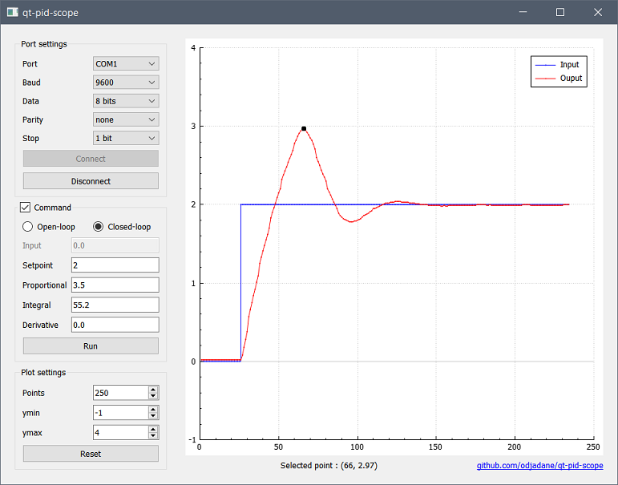

# qt-pid-scope
## About

A Qt interface to ease PID tuning by displaying both of the setpoint and the output of a process in real time.

Measurements are done by a microcontroller, then are sent, at regular intervals, to the computer via the serial interface.

To be processed accordingly this the program, the measurements must be sent in a specific format. A suitable function must also be implemented in the microcontroller to process the parameters sent from the computer.

```
// Format for measurements (from uc to pc)
<input/output>

// Format for Open-Loop parameters (from pc to uc)
(OL/input)

// Format for Closed-Loop parameters (from pc to uc)
(CL/setpoint/kp/ki/kd)
```

This application can be seen in action [in this video](https://www.youtube.com/watch?v=Imp_jYF0e8U).

## Build

This project has been successfully built using : 

- Qt 5.15.1
- CMake 3.19.5 (make file included)
- QCustomPlot 2.1.0 (source files are not included, must be downloaded from this [link](https://www.qcustomplot.com/index.php/download)).

Pre-built binaries for Windows can be downloaded from the release section on the sidebar. 

## Screenshot



## Acknowledgments

- [serial_port_plotter](https://github.com/CieNTi/serial_port_plotter)